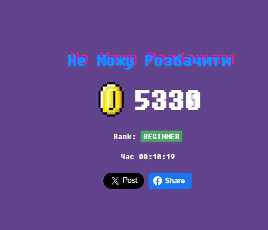

Завдання 1. Ролі, рівні та типи тестування

1.1 Ролі в розробці фічі
    
    Developer (Розробник)
    Реалізує форму логіну (поля, кнопки, валідацію).
    Пише бізнес-логіку авторизації та обробку помилок.

    QA Engineer (Тестувальник)
    Перевіряє коректність роботи форми.
    Створює тест-кейси, знаходить баги, перевіряє edge cases.

    Product Manager (PM)
    Визначає вимоги до форми (що має відбуватись при логіні).
    Формує user story та критерії прийняття.

    UI/UX Designer
    Проєктує вигляд форми (поля, кнопки, повідомлення).
    Забезпечує зручність використання.

    DevOps (опціонально)
    Налаштовує середовище для тестування і деплою.

1.2 Рівні тестування
    
    Unit Testing
    
    Перевірка окремих функцій:
    валідація email
    перевірка password

    Integration Testing
    
    Перевірка взаємодії:
    форма → сервер
    логін → база даних
    System Testing

    Перевірка всієї системи:

    повний процес логіну
    обробка помилок

    Acceptance Testing (UAT)

    Перевірка відповідності вимогам:
    чи може користувач увійти
    чи зрозумілі помилки

1.3 Типи тестування

    Функціональні
    Functional Testing
    правильний логін → успіх
    неправильний → помилка
    Validation Testing
    неправильний email (без @)
    пусті поля
    UI Testing
    кнопки працюють
    повідомлення відображаються
    API Testing
    запит логіну (POST /login)
    правильна відповідь сервера
    Нефункціональні
    Performance Testing
    швидкість логіну
    час відповіді сервера
    Security Testing (дуже важливо!)
    захист пароля
    SQL injection
    brute force
    Usability Testing
    зручність форми
    зрозумілість помилок
    Compatibility Testing
    робота в різних браузерах
    адаптація під мобільні
    Accessibility Testing
    доступність для людей з обмеженнями
    Готово

Завдання 2. Знайди різницю в макетах (Cantunsee.space)
