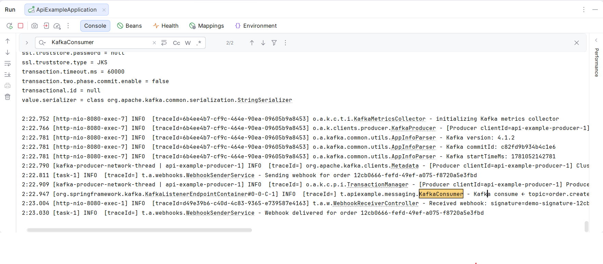

# Лабораторна робота: API та інтеграції

## Титульна інформація

**ПІБ:** Римарцов Володимир
**Група:** 371
**Дата:** 09.06.2026

---

## Мета роботи

Мета роботи — закріпити теоретичні знання про API та інтеграції на практиці, запустити навчальний API-сервіс, виконати запити різними способами та оформити результати у вигляді звіту.

---

## Завдання 1. Документація API через Swagger

Було відкрито Swagger UI за адресою:

```text
http://localhost:8080/swagger-ui.html
```

У Swagger UI було розгорнуто розділ **Books v1** та знайдено схему `BookRequestV1`.


Поле `isbn` має містити 13 цифр. Поле `priceUah` повинно бути числовим значенням не менше 0.

---

## Завдання 2. Аутентифікація через JWT

Спочатку було виконано запит до захищеного endpoint без JWT-токена.

```bash
curl -i http://localhost:8080/api/v1/books
```

У результаті сервер повернув статус `401 Unauthorized`.


Після цього було виконано логін з обліковими даними `admin / admin`.

```bash
curl -X POST http://localhost:8080/auth/login \
  -H "Content-Type: application/json" \
  -d '{"username":"admin","password":"admin"}'
```

У відповіді було отримано JWT-токен.


Далі було виконано запит до `GET /api/v1/books` з токеном.

```bash
curl -i -H "Authorization: Bearer $TOKEN" http://localhost:8080/api/v1/books
```

Сервер повернув статус `200 OK` і список книг.


Після зміни останнього символу токена запит знову повернув `401 Unauthorized`.


---

## Завдання 3. REST CRUD

Для перевірки REST CRUD було створено нову книгу через `POST /api/v1/books`.

```bash
curl -i -X POST http://localhost:8080/api/v1/books \
  -H "Authorization: Bearer $TOKEN" \
  -H "Content-Type: application/json" \
  -d '{
    "title": "Coffee Machine API",
    "author": "Rymartsov Volodymyr",
    "isbn": "9781234567890",
    "priceUah": 500
  }'
```

У відповідь було отримано статус `201 Created` і заголовок `Location`.


Після цього створену книгу було отримано через `GET /api/v1/books/{id}`.


Потім книгу було видалено через `DELETE /api/v1/books/{id}`.


`POST` повертає `201 Created`, тому що створюється новий ресурс. `DELETE` повертає `204 No Content`, тому що ресурс видалено і тіло відповіді не потрібне.

---

## Завдання 4. Структуровані помилки і traceId

Було виконано запит до неіснуючої книги:

```bash
curl -i -H "Authorization: Bearer $TOKEN" http://localhost:8080/api/v1/books/9999
```

Сервер повернув статус `404 Not Found` і JSON-відповідь з полями `code`, `message`, `traceId`.


Після цього було виконано запит із власним заголовком `X-Trace-Id`.

```bash
curl -i -H "X-Trace-Id: lab-rymartcov" \
  -H "Authorization: Bearer $TOKEN" \
  http://localhost:8080/api/v1/books/9999
```

У логах Spring Boot було знайдено запис з `traceId=lab-rymartcov`.


---

## Завдання 5. Версіонування API v1 та v2

Було виконано запит до першої версії API:

```bash
curl -s -H "Authorization: Bearer $TOKEN" http://localhost:8080/api/v1/books/1
```


Також було виконано запит до другої версії API:

```bash
curl -s -H "Authorization: Bearer $TOKEN" http://localhost:8080/api/v2/books/1
```


Для v1 було переглянуто заголовки відповіді:

```bash
curl -sI -H "Authorization: Bearer $TOKEN" http://localhost:8080/api/v1/books
```

У заголовках видно `Deprecation`, `Sunset` і `Link`.


У v2 відрізняється представлення ціни: замість старого формату `priceUah` використовується оновлений формат/поле ціни.

---

## Завдання 6. GraphQL

Було відкрито GraphiQL:

```text
http://localhost:8080/graphiql
```

Перший запит повертав тільки `title` і `author` для всіх книг.

```graphql
{
  books {
    title
    author
  }
}
```


Другий запит повертав `title` і `priceUah` для книги з `id=1`.

```graphql
{
  book(id: 1) {
    title
    priceUah
  }
}
```


GraphQL відрізняється від REST тим, що клієнт сам вказує, які саме поля хоче отримати у відповіді.

---

## Завдання 7. WebSocket

Було відкрито сторінку чату у двох вкладках браузера:

```text
http://localhost:8080/chat.html
```

Після надсилання повідомлень з різних вкладок вони миттєво з’являлися в обох вікнах.


Це не можна зручно реалізувати простим HTTP GET, тому що HTTP працює за принципом запит-відповідь. Для real-time обміну потрібне постійне двостороннє з’єднання, яке забезпечує WebSocket.

---

## Завдання 8. Асинхронна інтеграція через Kafka

Для запуску Kafka було виконано команду:

```bash
docker compose up -d
```

Після цього Spring Boot застосунок було перезапущено.

Було відкрито Kafka UI:

```text
http://localhost:8090
```


Після цього було створено замовлення:

```bash
curl -X POST http://localhost:8080/orders \
  -H "Authorization: Bearer $TOKEN" \
  -H "Content-Type: application/json" \
  -d '{"bookId":1,"quantity":2}'
```

У Kafka UI з’явився топік `order.created`, у якому було видно повідомлення про створене замовлення.


У вкладці Consumers було видно групу `api-example` з offset.


У логах Spring Boot було видно послідовність обробки:

```text
OrderService → KafkaProducer → KafkaConsumer → WebhookSenderService → WebhookReceiverController
```




---

# Відповіді на питання

## 1. Які помилки може зробити фронтенд-розробник без Swagger?

Він може неправильно вказати URL endpoint, передати неправильні поля в JSON або не врахувати обов’язкові обмеження, наприклад формат ISBN чи мінімальне значення ціни.

## 2. Що буде, якщо JWT перехопити в публічному Wi-Fi?

Якщо токен перехопити, зловмисник може тимчасово виконувати запити від імені користувача. Щоб зменшити ризик, використовують HTTPS, короткий час життя токена, refresh-токени та повторну авторизацію.

## 3. Чому в REST не варто робити `/getBooks` або `/deleteBook/5`?

У REST дія визначається HTTP-методом, а URL має описувати ресурс. Тому краще використовувати `GET /books` або `DELETE /books/5`, а не додавати дію прямо в URL.

## 4. Як traceId допомагає у логах?

`traceId` дозволяє знайти всі записи в логах, які стосуються одного конкретного запиту. Це корисно, коли логів дуже багато і потрібно швидко знайти причину помилки.

## 5. Чи є додавання поля `discount` breaking change?

Додавання нового необов’язкового поля зазвичай не є breaking change. Але перейменування `priceUah` на `price` є breaking change, бо старі клієнти можуть перестати правильно обробляти відповідь.

## 6. Чому GraphQL зручніший для мобільних застосунків?

GraphQL дозволяє отримувати тільки потрібні поля, тому зменшується обсяг переданих даних. Це зручно для мобільних застосунків зі слабким або нестабільним інтернетом.

## 7. Як Telegram надсилає повідомлення миттєво?

Telegram не змушує телефон постійно питати сервер щосекунди. Для миттєвого обміну використовується постійне з’єднання або push-механізм, коли сервер сам надсилає нові повідомлення клієнту.

## 8. Який сценарій кращий для оплати замовлення?

Кращий сценарій — коли бекенд приймає замовлення, повертає `202 Accepted` і обробляє його асинхронно через чергу. Це краще, бо фронтенд не зависає на 30 секунд, а система може надійно обробити подію у фоні.

---

# Чек-лист перед здачею

* [x] У звіті є титулка з ПІБ, групою, датою.
* [x] Усі 8 обов’язкових завдань мають свої розділи.
* [x] У кожному завданні є місце для скріну.
* [x] У звіті є відповіді на всі 8 питань.
* [x] У звіті є чек-лист самоперевірки.
* [x] Файл названий `lab_api_rymartcov.md`.
