# Лабораторна робота: API та інтеграції

## Титульна інформація

**ПІБ:** Римарцов Володимир
**Група:** 371
**Дата:** 10.06.2026

---

## Мета роботи

Мета роботи — закріпити теоретичні знання про API та інтеграції на практиці, запустити навчальний API-сервіс, виконати запити різними способами та оформити результати у вигляді звіту.

---

## Підготовка до виконання

Для виконання лабораторної роботи було використано навчальний проєкт `api-example`.

Проєкт було запущено командою:

```bash
./gradlew bootRun
```

Після запуску головна сторінка проєкту була доступна за адресою:

```text
http://localhost:8080
```

---

# Завдання 1. Документація API через Swagger

**Відповідна практика з README:** Практика 1 — Дивимось контракт API через Swagger UI.

Було відкрито Swagger UI за адресою:

```text
http://localhost:8080/swagger-ui.html
```

У Swagger UI було розгорнуто розділ **Books v1**. У цьому розділі видно endpoints для роботи з книгами: `GET`, `POST`, `PUT`, `DELETE`.

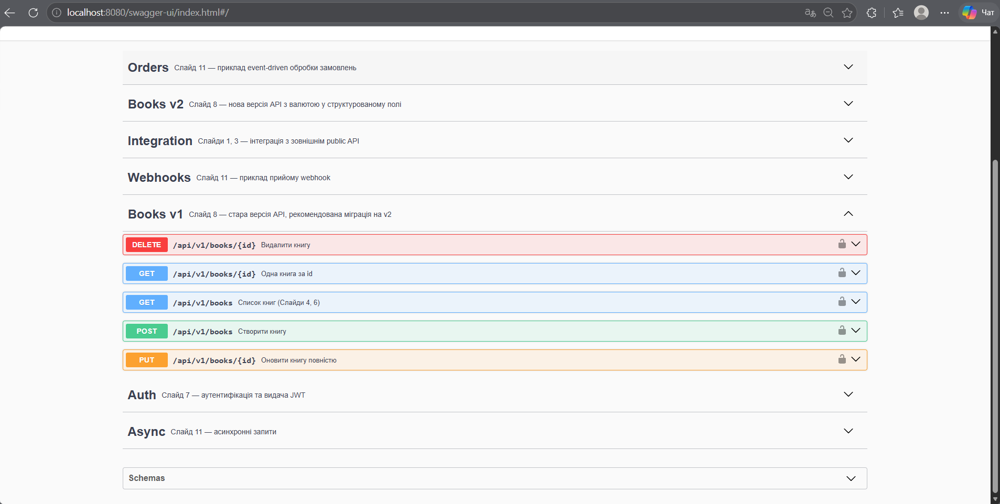

Також було відкрито схему `BookRequestV1`.

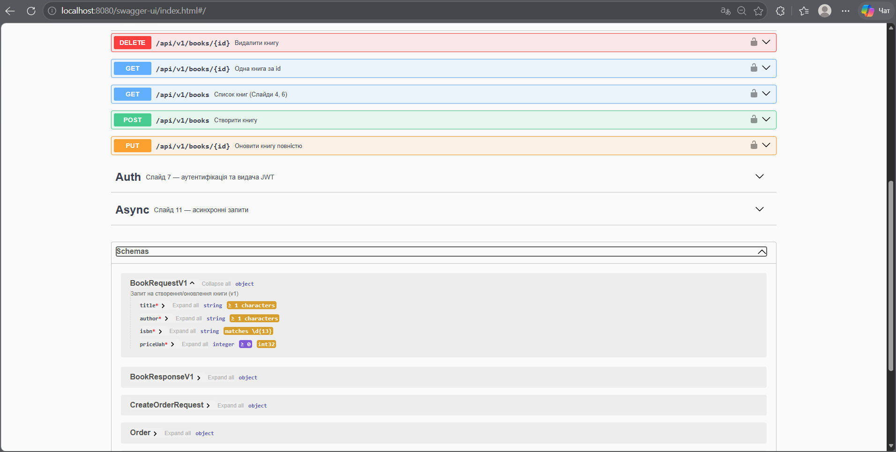

Поле `isbn` має відповідати шаблону з 13 цифр. Поле `priceUah` повинно бути числовим значенням не менше 0.

---

# Завдання 2. Аутентифікація через JWT

**Відповідна практика з README:** Практика 3 — Аутентифікація через JWT.

Спочатку було виконано запит до захищеного endpoint без JWT-токена:

```bash
curl -i http://localhost:8080/api/v1/books
```

У результаті сервер повернув статус:

```text
401 Unauthorized
```

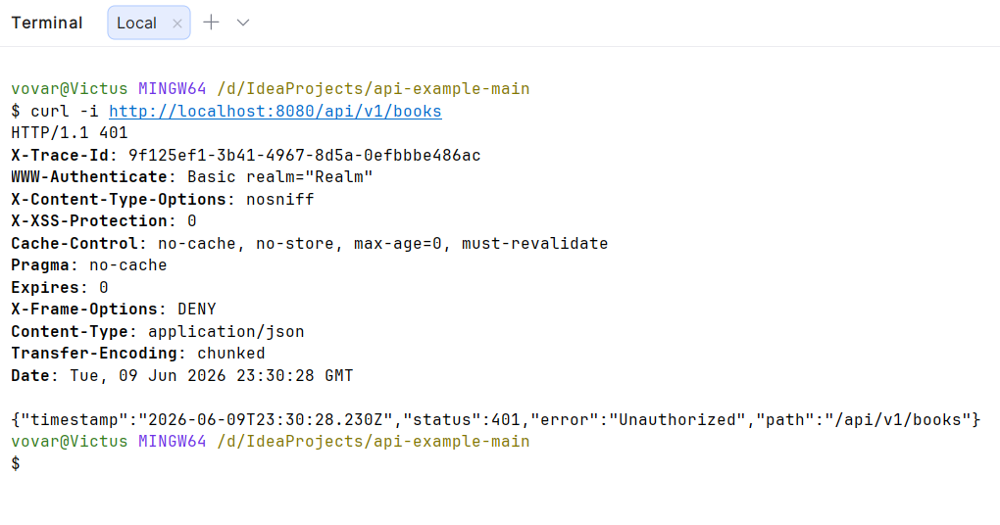

Після цього було виконано логін з обліковими даними `admin / admin`:

```bash
curl -X POST http://localhost:8080/auth/login \
  -H "Content-Type: application/json" \
  -d '{"username":"admin","password":"admin"}'
```

У відповіді було отримано JWT-токен.

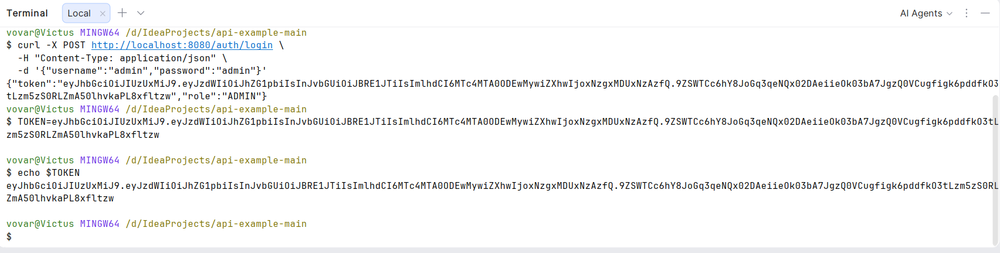

Далі було виконано той самий запит, але вже з JWT-токеном:

```bash
curl -i -H "Authorization: Bearer $TOKEN" http://localhost:8080/api/v1/books
```

У результаті сервер повернув статус:

```text
200 OK
```

і список книг.

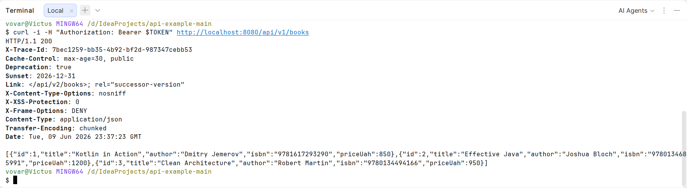

Після цього токен було навмисно зіпсовано шляхом зміни останнього символу:

```bash
BAD_TOKEN="${TOKEN%?}X"

curl -i -H "Authorization: Bearer $BAD_TOKEN" http://localhost:8080/api/v1/books
```

Сервер знову повернув статус:

```text
401 Unauthorized
```

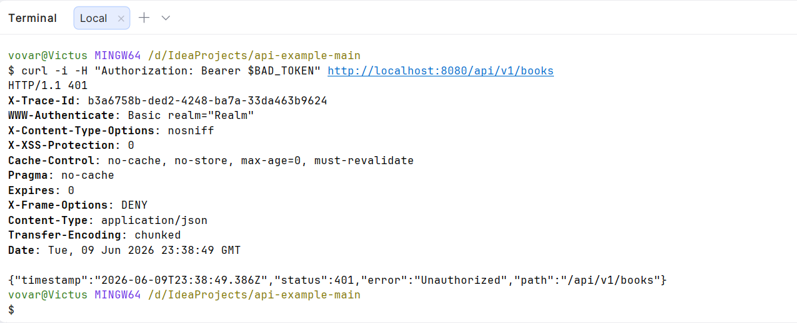

Це показує, що доступ до захищених endpoint можливий тільки з правильним JWT-токеном.

---

# Завдання 3. REST CRUD

**Відповідна практика з README:** Практика 4 — REST CRUD.

Для перевірки REST CRUD було створено нову книгу через `POST /api/v1/books`.

```bash
curl -i -X POST http://localhost:8080/api/v1/books \
  -H "Authorization: Bearer $TOKEN" \
  -H "Content-Type: application/json" \
  -d '{
    "title": "Coffee Machine API",
    "author": "Rymartsov Volodymyr",
    "isbn": "9781234567890",
    "priceUah": 500
  }'
```

У відповідь було отримано статус:

```text
201 Created
```

Також у відповіді був заголовок `Location`, який вказує адресу створеного ресурсу.

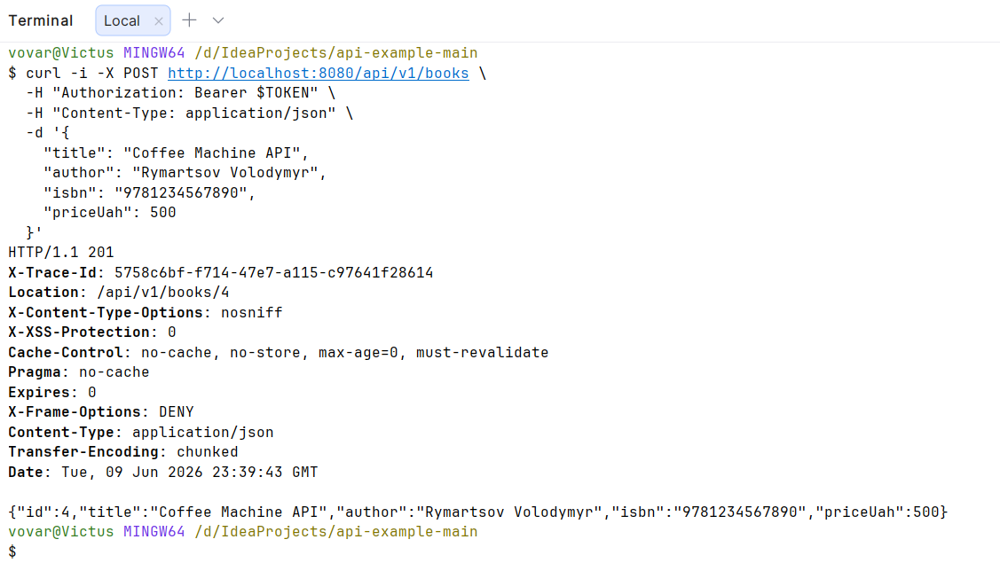

Після цього створену книгу було отримано через `GET /api/v1/books/{id}`.

```bash
curl -i -H "Authorization: Bearer $TOKEN" http://localhost:8080/api/v1/books/ID
```

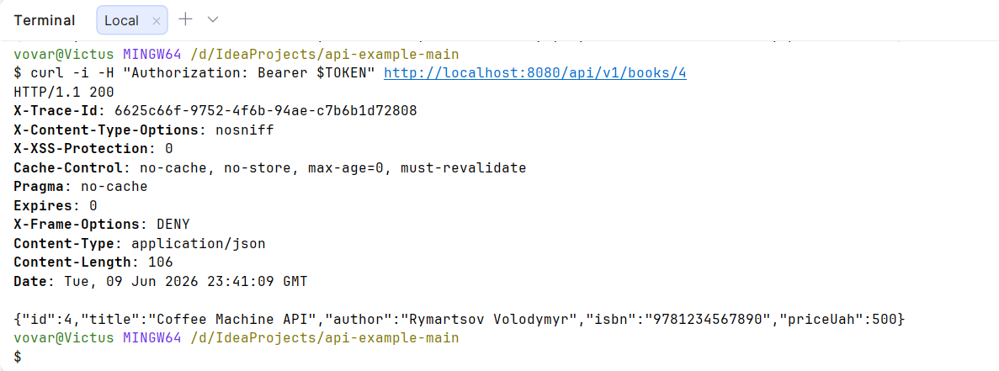

Потім створену книгу було видалено через `DELETE /api/v1/books/{id}`.

```bash
curl -i -X DELETE -H "Authorization: Bearer $TOKEN" http://localhost:8080/api/v1/books/ID
```

У результаті сервер повернув статус:

```text
204 No Content
```

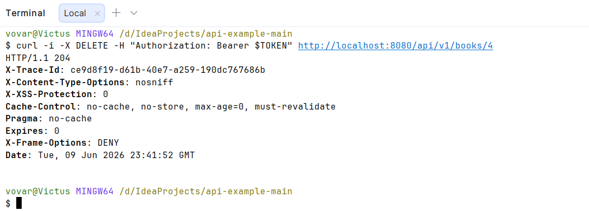

`POST` повертає `201 Created`, тому що створюється новий ресурс. `DELETE` повертає `204 No Content`, тому що ресурс видалено і тіло відповіді не потрібне.

---

# Завдання 4. Структуровані помилки і traceId

**Відповідна практика з README:** Практика 5 — Помилки і трасування.

Було виконано запит до неіснуючої книги:

```bash
curl -i -H "Authorization: Bearer $TOKEN" http://localhost:8080/api/v1/books/9999
```

Сервер повернув статус:

```text
404 Not Found
```

У JSON-відповіді були поля `code`, `message`, `traceId`.

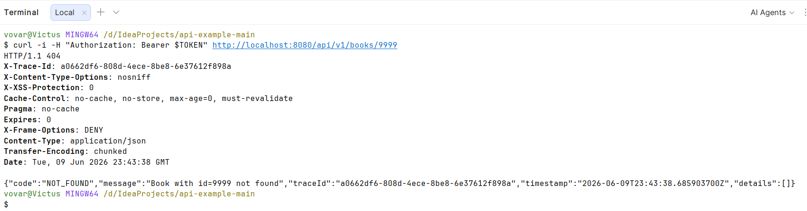

Після цього було виконано повторний запит із власним заголовком `X-Trace-Id`:

```bash
curl -i -H "X-Trace-Id: lab-rymartcov" \
  -H "Authorization: Bearer $TOKEN" \
  http://localhost:8080/api/v1/books/9999
```

У логах Spring Boot було знайдено запис з власним traceId:

```text
traceId=lab-rymartcov
```

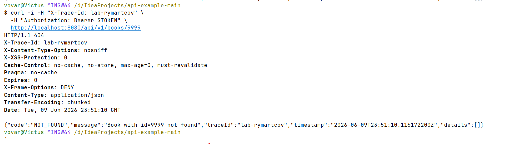

`traceId` потрібен для того, щоб можна було швидко знайти всі записи в логах, які стосуються одного конкретного запиту.

---

# Завдання 5. Версіонування API v1 та v2

**Відповідна практика з README:** Практика 6 — Версіонування API v1 vs v2.

Було виконано запит до першої версії API:

```bash
curl -s -H "Authorization: Bearer $TOKEN" http://localhost:8080/api/v1/books/1
```

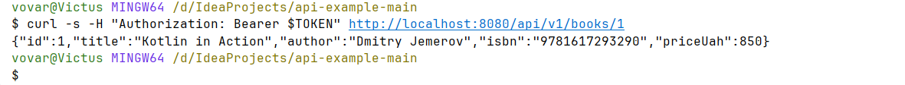

Також було виконано запит до другої версії API:

```bash
curl -s -H "Authorization: Bearer $TOKEN" http://localhost:8080/api/v2/books/1
```

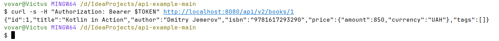

Після цього було переглянуто заголовки відповіді для v1:

```bash
curl -sI -H "Authorization: Bearer $TOKEN" http://localhost:8080/api/v1/books
```

У заголовках видно `Deprecation`, `Sunset` та `Link`.

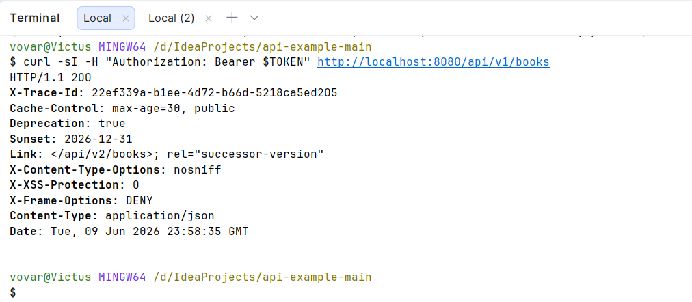

У v2 відрізняється представлення ціни. У першій версії використовується поле `priceUah`, а у другій версії відповідь має оновлений формат ціни.

---

# Завдання 6. GraphQL

**Відповідна практика з README:** Практика 7 — GraphQL.

Було відкрито GraphiQL за адресою:

```text
http://localhost:8080/graphiql
```

Перший GraphQL-запит повертав тільки `title` і `author` для всіх книг.

```graphql
{
  books {
    title
    author
  }
}
```

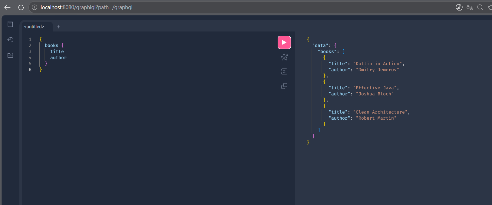

Другий GraphQL-запит повертав `title` і `priceUah` для книги з `id=1`.

```graphql
{
  book(id: 1) {
    title
    priceUah
  }
}
```

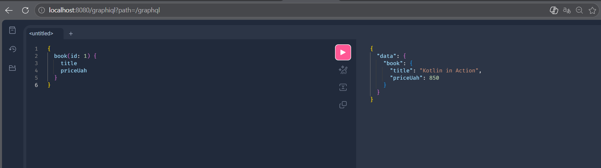

GraphQL відрізняється від REST тим, що клієнт сам вказує, які саме поля хоче отримати у відповіді. Завдяки цьому у відповідь не потрапляють зайві дані.

---

# Завдання 7. WebSocket

**Відповідна практика з README:** Практика 8 — WebSocket.

Було відкрито сторінку чату у двох вкладках браузера:

```text
http://localhost:8080/chat.html
```

Після надсилання повідомлень з різних вкладок вони миттєво з’являлися в обох вікнах.

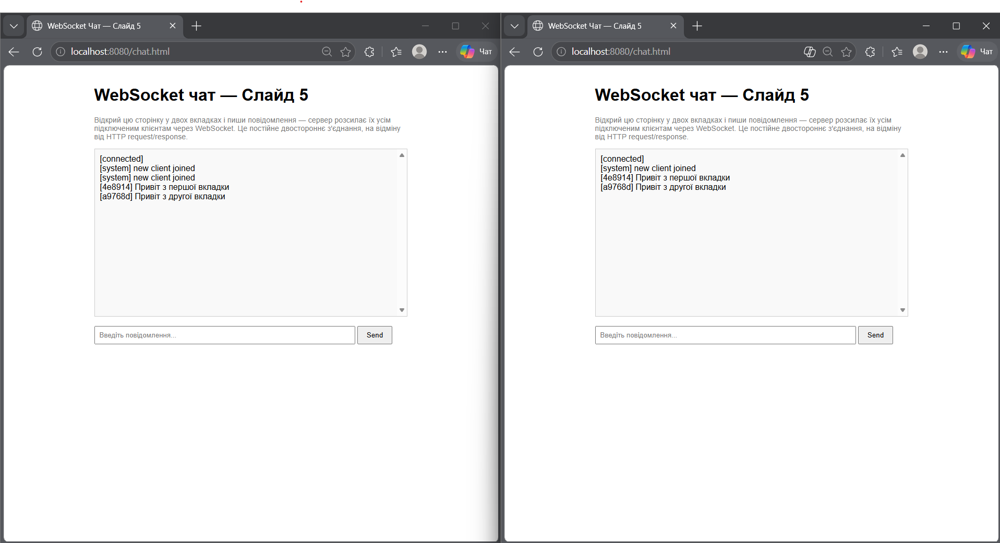

Це не можна зручно реалізувати простим HTTP GET, тому що HTTP працює за принципом запит-відповідь. Для real-time обміну потрібне постійне двостороннє з’єднання, яке забезпечує WebSocket.

---

# Завдання 8. Асинхронна інтеграція через Kafka

**Відповідна практика з README:** Практика 10 — Асинхронні інтеграції з Kafka.

Для запуску Kafka і Kafka UI було виконано команду:

```bash
docker compose up -d
```

Після цього Spring Boot застосунок було перезапущено:

```bash
./gradlew bootRun
```

Було відкрито Kafka UI за адресою:

```text
http://localhost:8090
```

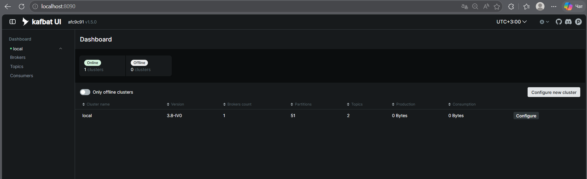

Після цього було створено замовлення:

```bash
curl -X POST http://localhost:8080/orders \
  -H "Authorization: Bearer $TOKEN" \
  -H "Content-Type: application/json" \
  -d '{"bookId":1,"quantity":2}'
```

У Kafka UI з’явився топік:

```text
order.created
```

Усередині топіка було видно повідомлення про створене замовлення.

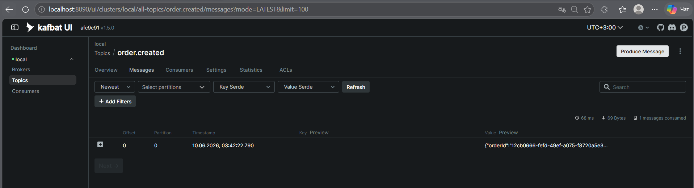

У вкладці **Consumers** було видно групу:

```text
api-example
```

з offset.

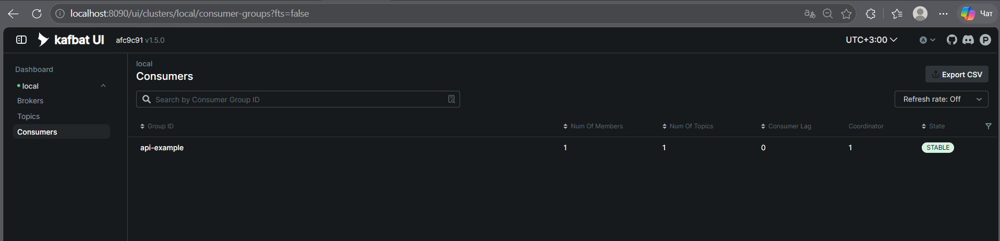

У логах Spring Boot було видно послідовність обробки:

```text
OrderService → KafkaProducer → KafkaConsumer → WebhookSenderService → WebhookReceiverController
```

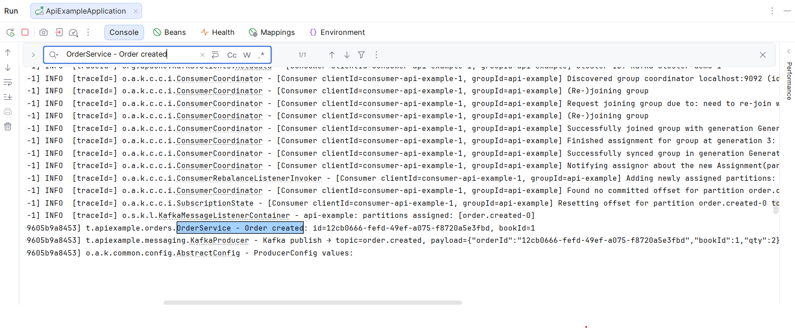

Kafka дозволяє виконувати асинхронну обробку подій. Це корисно тоді, коли операцію не потрібно завершувати миттєво у відповідь на HTTP-запит.

---

# Відповіді на питання

## 1. Уяви фронтенд-розробника, який інтегрується з нашим API, але не має Swagger. Які три типи помилок він з найбільшою ймовірністю зробить?

Без Swagger фронтенд-розробник може неправильно вказати URL endpoint, передати неправильні поля в JSON або не врахувати обов’язкові обмеження, наприклад формат ISBN чи мінімальне значення ціни.

## 2. Що станеться, якщо токен JWT перехопити в публічному Wi-Fi? Що зазвичай роблять, щоб це не було катастрофою?

Якщо JWT-токен перехопити, зловмисник може тимчасово виконувати запити від імені користувача. Щоб зменшити ризик, використовують HTTPS, короткий час життя токена, refresh-токени та повторну авторизацію.

## 3. Чому в REST не варто робити URL виду `/getBooks` або `/deleteBook/5`?

У REST дія визначається HTTP-методом, а URL має описувати ресурс. Тому краще використовувати `GET /books` або `DELETE /books/5`, а не додавати дію прямо в URL.

## 4. Користувач каже: "у мене не пройшла оплата вчора десь увечері". У тебе мільйони рядків логів за день. Як traceId допомагає?

`traceId` дозволяє знайти всі записи в логах, які стосуються одного конкретного запиту або операції. Це значно спрощує пошук причини помилки серед великої кількості логів.

## 5. Ти додаєш у JSON-відповідь нове поле `discount`. Це breaking change? А якщо перейменовуєш `priceUah` на `price`?

Додавання нового необов’язкового поля `discount` зазвичай не є breaking change. Але перейменування `priceUah` на `price` є breaking change, тому що старі клієнти можуть перестати правильно обробляти відповідь.

## 6. Чому GraphQL зручніший для мобільних застосунків зі слабким інтернетом?

GraphQL дозволяє отримувати тільки потрібні поля, тому зменшується обсяг переданих даних. Це зручно для мобільних застосунків зі слабким або нестабільним інтернетом.

## 7. Telegram надсилає тобі повідомлення миттєво. Як це реалізовано — твій телефон опитує сервер кожну секунду, чи Telegram надсилає сам?

Telegram не змушує телефон постійно опитувати сервер кожну секунду. Для миттєвого обміну використовується постійне з’єднання або push-механізм, коли сервер сам надсилає нові повідомлення клієнту.

## 8. Який сценарій кращий для оплати замовлення: фронтенд 30 секунд чекає чи бекенд приймає замовлення і обробляє асинхронно через чергу?

Кращий сценарій — коли бекенд приймає замовлення, повертає `202 Accepted` і обробляє його асинхронно через чергу. Це краще, тому що фронтенд не зависає на довгий час, а система може надійно обробити подію у фоні.

---

# Чек-лист перед здачею

* [x] У звіті є титулка з ПІБ, групою, датою.
* [x] Усі 8 обов’язкових завдань мають свої розділи.
* [x] У кожному завданні є місце для скріну.
* [x] На скрінах мають бути видні URL або команда та результат.
* [x] У звіті є відповіді на всі 8 питань.
* [x] Файл названий `lab_api_rymartcov.md`.
* [x] Перед здачею потрібно перевірити, що всі картинки з папки `images/` відображаються.

---

# Висновок

У ході лабораторної роботи було запущено навчальний API-сервіс і перевірено різні способи взаємодії з ним. Було розглянуто документацію API через Swagger, аутентифікацію через JWT, виконання REST CRUD-операцій, роботу зі структурованими помилками та traceId, версіонування API, GraphQL, WebSocket і асинхронну інтеграцію через Kafka.

Під час виконання роботи було показано, що різні типи API та інтеграцій використовуються для різних задач. REST зручний для стандартних CRUD-операцій, GraphQL дозволяє отримувати тільки потрібні поля, WebSocket підходить для real-time обміну, а Kafka використовується для асинхронної обробки подій.

Лабораторна робота дозволила краще зрозуміти, як API працює на практиці, як захищати endpoints за допомогою JWT, як аналізувати помилки через traceId і як організовувати інтеграцію між різними частинами системи.
