# Лабораторна робота №22

## Горизонтальне масштабування і балансування

**Виконав:** Римарцов Володимир
**Група:** 371

---

# Завдання 1 — Запуск однієї репліки

## Хід виконання

Спочатку було виконано складання Docker-образу та запуск контейнерів за допомогою команд:

```bash
docker compose build
docker compose up -d
```

Після запуску було перевірено список контейнерів командою:

```bash
docker compose ps
```

У результаті було видно, що запущена одна репліка вебдодатку `web-1`, а також допоміжні сервіси `nginx` і `redis`.

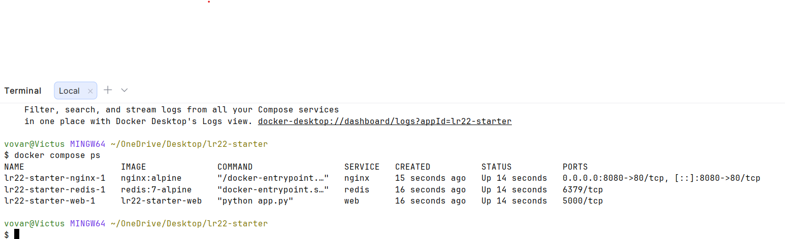

Після цього у браузері було відкрито сторінку:

```text
http://localhost:8080
```

Сторінка була оновлена кілька разів. Значення поля `Hostname` не змінювалося, оскільки запити обробляла одна й та сама репліка вебдодатку.

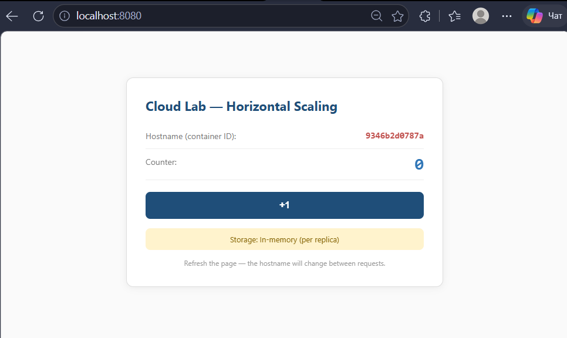

## Висновок до завдання

Поле `Hostname` показує ім’я контейнера, який обробив запит користувача. У цьому завданні hostname не змінювався, тому що була запущена тільки одна репліка вебдодатку.

---

# Завдання 2 — Горизонтальне масштабування до 3 реплік

## Хід виконання

Для масштабування вебдодатку до трьох реплік спочатку було зупинено поточний запуск:

```bash
docker compose down
```

Після цього систему було запущено з параметром масштабування:

```bash
docker compose up -d --scale web=3
```

Перевірка контейнерів виконувалася командою:

```bash
docker compose ps
```

У результаті було видно три запущені web-контейнери, тобто вебдодаток працював у трьох репліках.

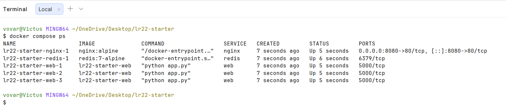

Після відкриття сторінки `http://localhost:8080` та кількох оновлень значення `Hostname` почало змінюватися. Це означає, що nginx розподіляє запити між кількома репліками.

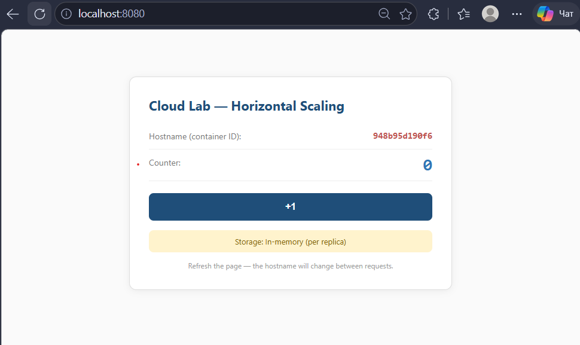

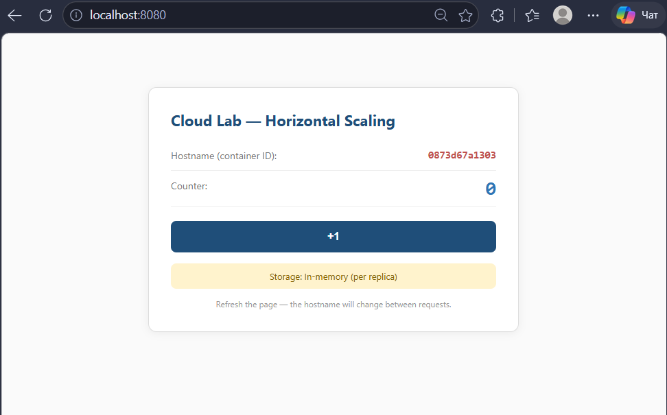

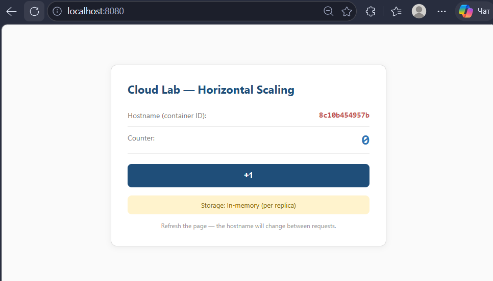

## Висновок до завдання

У цьому випадку nginx виконує балансування навантаження між трьома репліками вебдодатку. Через це при оновленні сторінки користувач може бачити різні значення `Hostname`, бо кожен запит може потрапляти на інший контейнер.

---

# Завдання 3 — Stateless-пастка: «стрибаючий» лічильник

## Хід виконання

Після запуску трьох реплік було кілька разів натиснуто кнопку `+1` на сторінці вебдодатку. Очікувалося, що лічильник буде збільшуватись послідовно: 1, 2, 3, 4 і так далі.

Проте значення лічильника змінювалося непослідовно. Наприклад, після натискання кнопки число могло збільшуватися, а потім зменшуватися або переходити на інше значення.

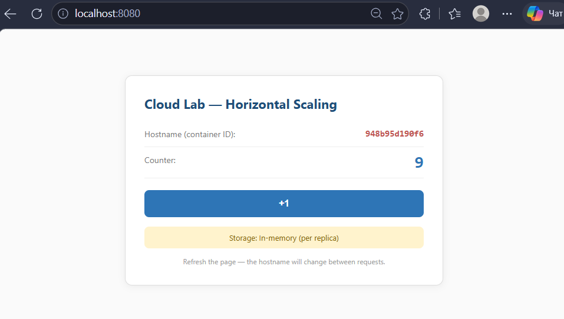

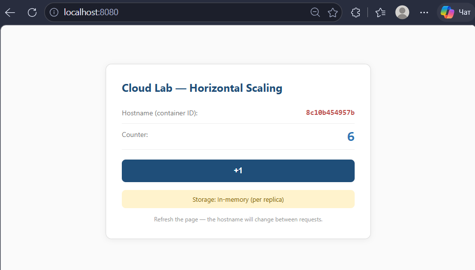

## Пояснення

Така поведінка виникає через те, що кожна репліка вебдодатку має власну пам’ять процесу. Лічильник зберігається не в спільному сховищі, а окремо всередині кожного контейнера. Через балансувальник запити потрапляють на різні репліки, тому користувач бачить значення з різних незалежних лічильників. Саме тому counter починає «стрибати».

---

# Завдання 4 — Виправлення через зовнішнє сховище Redis

## Хід виконання

Для виправлення проблеми зі «стрибаючим» лічильником систему було перезапущено з використанням Redis:

```bash
docker compose down
USE_REDIS=true docker compose up -d --scale web=3
```

Після запуску було виконано перевірку контейнерів:

```bash
docker compose ps
```

У списку контейнерів було видно, що разом із трьома репліками вебдодатку працює контейнер `redis`.

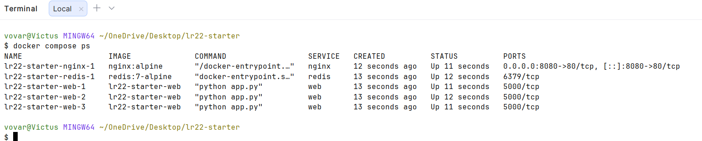

Після цього на сторінці знову було кілька разів натиснуто кнопку `+1`. Тепер лічильник збільшувався послідовно: 1, 2, 3, 4, 5 і далі.

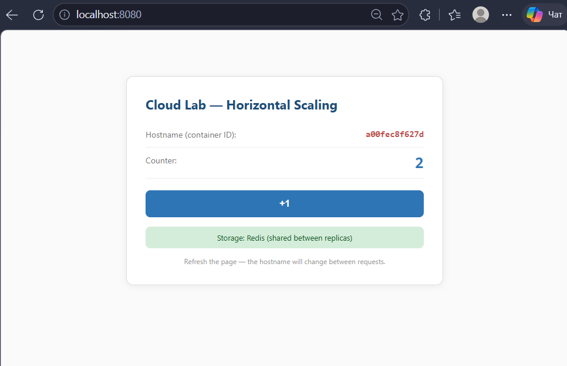

## Пояснення

Redis у цій системі виконує роль зовнішнього спільного сховища стану. Тепер значення лічильника зберігається не окремо в пам’яті кожної репліки, а в одному спільному місці. Завдяки цьому всі три репліки бачать однакове актуальне значення counter, тому лічильник зростає послідовно.

---

# Завдання 5 — Resilience: імітація відмови репліки

## Хід виконання

Після запуску системи з трьома репліками та Redis було переглянуто список контейнерів:

```bash
docker compose ps
```

Потім одну з web-реплік було примусово зупинено командою:

```bash
docker kill <container_id>
```

Після цього знову було виконано команду:

```bash
docker compose ps
```

У результаті було видно, що одна web-репліка більше не працює, а інші репліки залишилися у стані `Up`.

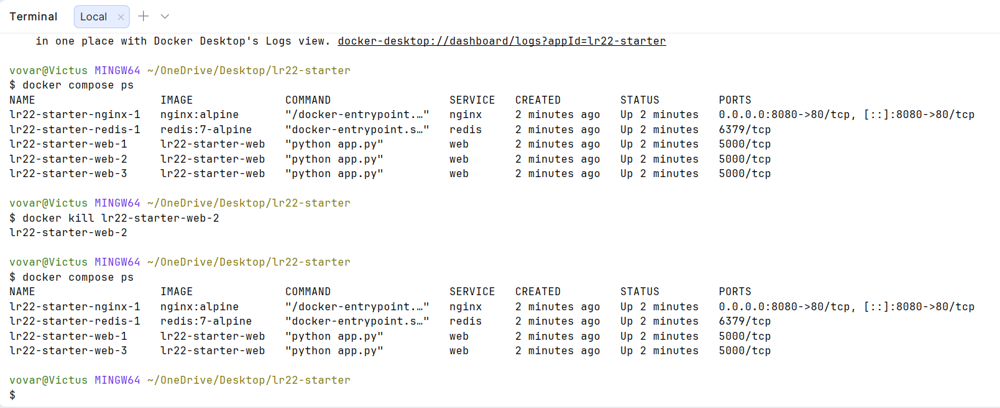

Після зупинки однієї репліки сторінка `http://localhost:8080` продовжила відкриватися. Було виконано кілька оновлень сторінки, і вебдодаток залишався доступним.

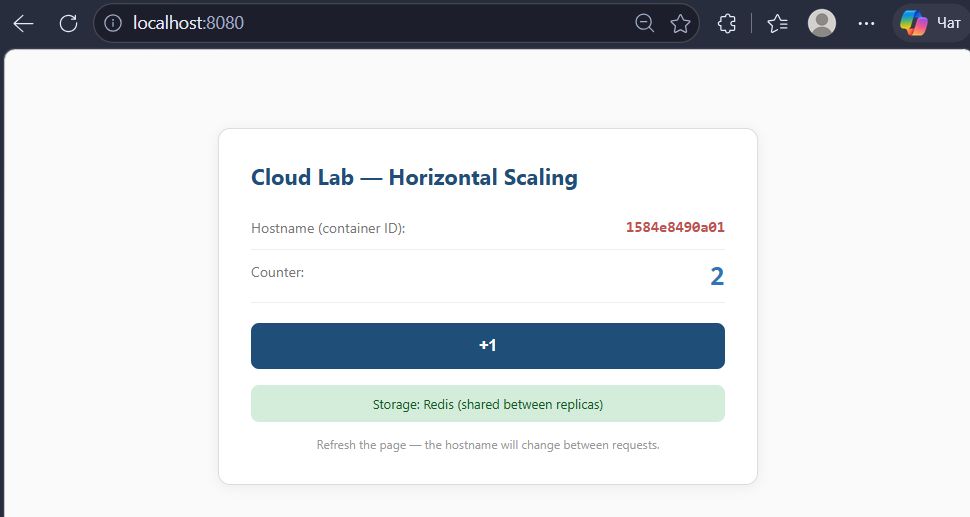

## Пояснення

Користувач не помітив відмови однієї репліки, тому що система мала надлишковість. Замість однієї репліки працювали три, тому після зупинки однієї з них nginx продовжив направляти запити на живі контейнери. Це пов’язано з поняттями redundancy та resilience: система має запасні екземпляри, які дозволяють їй залишатися доступною навіть після часткової відмови.

---

# Відповіді на питання

## 1. Чому горизонтальне масштабування зазвичай дешевше і гнучкіше за вертикальне?

Горизонтальне масштабування зазвичай дешевше і гнучкіше, тому що можна додавати кілька звичайних серверів або контейнерів замість купівлі одного дуже потужного сервера. Якщо навантаження зростає, достатньо додати нові репліки. Вертикальне масштабування має обмеження, бо будь-який сервер має максимальну кількість CPU, RAM і дискових ресурсів. Крім того, один великий сервер все одно залишається єдиною точкою відмови.

## 2. Що буде з монолітним додатком, якщо сесія зберігається в пам’яті процесу, а його запустити в трьох екземплярах?

Якщо сесія користувача зберігається тільки в пам’яті одного процесу, то при запуску трьох екземплярів можуть виникнути проблеми. Наприклад, користувач може авторизуватися на одній репліці, а наступний запит потрапить на іншу репліку, яка не знає про його сесію. Через це користувача може викидати з акаунта або дані в кошику можуть зникати. Це схоже на проблему зі «стрибаючим» лічильником у лабораторній роботі.

## 3. Які керовані сервіси AWS / Azure / GCP можуть виконувати роль зовнішнього сховища стану?

У реальній хмарі Redis часто використовують як керований сервіс, а не як простий контейнер. В AWS для цього можна використовувати Amazon ElastiCache for Redis. В Azure подібну роль виконує Azure Cache for Redis. У Google Cloud можна використати Memorystore for Redis. Такі сервіси дозволяють зберігати спільний стан окремо від реплік додатку.

## 4. Який приблизний SLA буде у кластера з 3 незалежних реплік, якщо кожна має SLA 99%?

Якщо одна репліка має SLA 99%, то ймовірність її відмови становить 1%, тобто 0.01. Якщо три репліки виходять з ладу незалежно, то ймовірність одночасної відмови всіх трьох дорівнює 0.01 × 0.01 × 0.01 = 0.000001. Отже, доступність кластера приблизно становить 99.9999%. Redundancy «множить дев’ятки», тому що сервіс перестає працювати тільки тоді, коли одночасно недоступні всі резервні репліки.

## 5. Який тип додатку не можна просто масштабувати горизонтально через `--scale=N`?

Не можна просто масштабувати додатки, які зберігають важливий стан тільки локально в пам’яті або на диску одного процесу. Наприклад, ігровий сервер з активним станом матчу або старий моноліт із локальними сесіями не можна без змін просто запустити у кількох копіях. Якщо запити користувача будуть потрапляти на різні репліки, дані можуть розходитися або губитися. Для такого масштабування потрібно винести стан у спільне сховище або змінити архітектуру додатку.

---

# Чек-лист самоперевірки

* [x] У звіті є титулка з ПІБ, групою, датою.
* [x] Усі 5 обов’язкових завдань мають свої розділи.
* [x] У кожному завданні є мінімум один скрін.
* [x] На скрінах видно URL у браузері та/або команду в терміналі і її результат.
* [x] У Завданні 2 на скрінах видно щонайменше 3 різні hostname.
* [x] У Завданні 3 видно «стрибки» лічильника.
* [x] У Завданні 4 видно монотонне зростання лічильника.
* [x] Відповіді на всі 5 питань присутні.
* [x] Файл названий `lab_scaling_rymartcov.md`.
* [x] Перед здачею звіт потрібно відкрити і перевірити, що всі картинки видно.

---

# Висновок

У ході лабораторної роботи було виконано запуск вебдодатку в Docker, перевірено роботу однієї репліки, виконано горизонтальне масштабування до трьох реплік і перевірено балансування запитів через nginx. Також було показано проблему збереження стану в пам’яті процесу, коли лічильник почав змінюватися непослідовно. Після підключення Redis значення лічильника стало спільним для всіх реплік і почало збільшуватися коректно. Наприкінці було перевірено відмовостійкість системи: після зупинки однієї репліки сайт продовжив працювати через наявність інших активних реплік.
