# Лабораторна №23 — Основи Docker і контейнери для навчання

**ПІБ:** Римарцов Володимир
**Група:** 371

---

## Частина 1 — Основи Docker

### Завдання 1 — Перший контейнер

Було виконано запуск першого контейнера `hello-world`. У результаті Docker завантажив образ і вивів повідомлення `Hello from Docker!`.

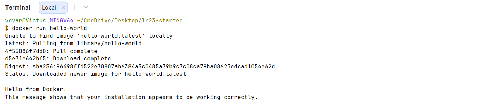

---

### Завдання 2 — Веб-сервер і проброс порту

Було запущено контейнер `nginx` з пробросом порту `8080:80`. Після цього було перевірено список запущених контейнерів командою `docker ps`.

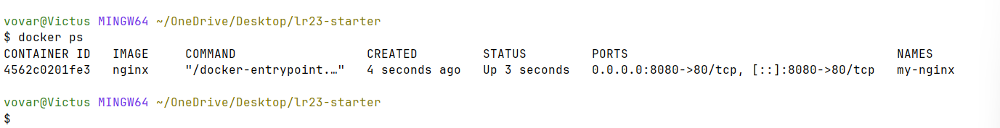

У браузері було відкрито сторінку `http://localhost:8080`, де з’явилася стандартна сторінка nginx.

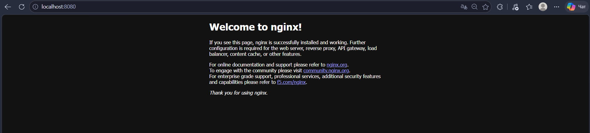

---

### Завдання 3 — Логи та exec

Було переглянуто логи контейнера `my-nginx`, після чого виконано вхід усередину контейнера за допомогою `docker exec -it my-nginx sh`. Усередині контейнера було переглянуто вміст каталогу `/usr/share/nginx/html` та інформацію про операційну систему через `/etc/os-release`.

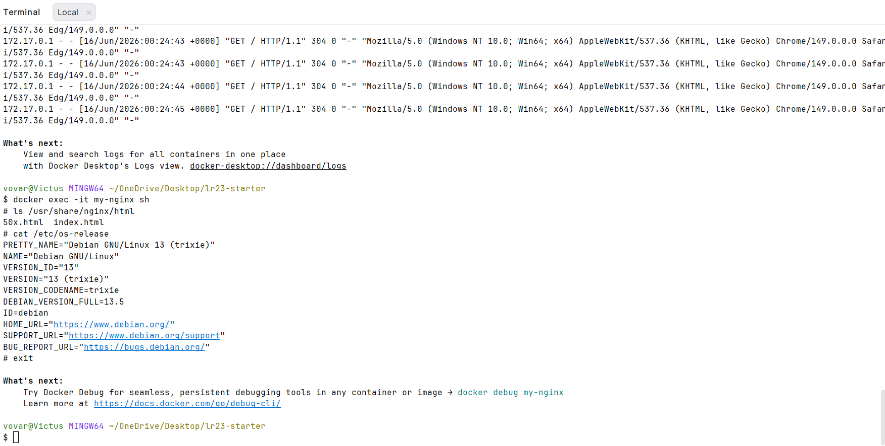

---

### Завдання 4 — Життєвий цикл контейнера

Було перевірено список активних і зупинених контейнерів, виконано запуск, зупинку та видалення контейнера `my-nginx`. Також було переглянуто локальні Docker-образи та видалено образ `nginx`.

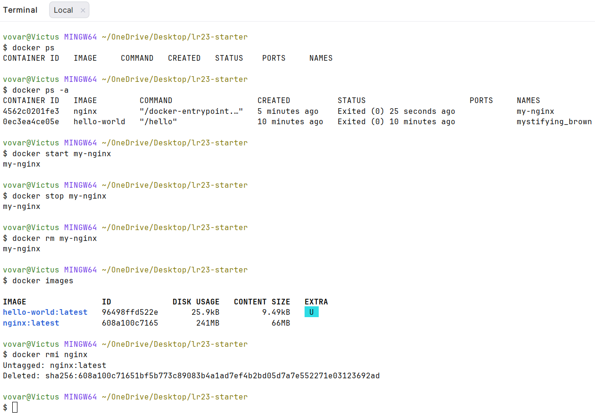

---

### Завдання 5 — Персистентність через volume

Було запущено контейнер Alpine з підключенням локальної папки `mydata` до каталогу `/data` всередині контейнера. Усередині контейнера було створено файл `hello.txt`, після виходу з контейнера файл залишився доступним на хост-системі.

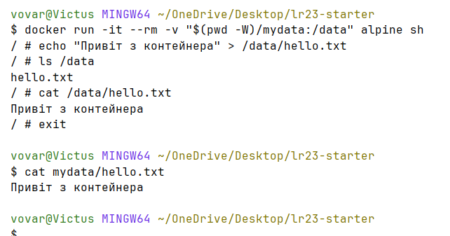

---

### Завдання 6 — Змінні середовища

Було запущено контейнер Alpine зі змінною середовища `MY_NAME`. Після цього було перевірено, що змінна передається всередину контейнера та доступна через команду `env`.

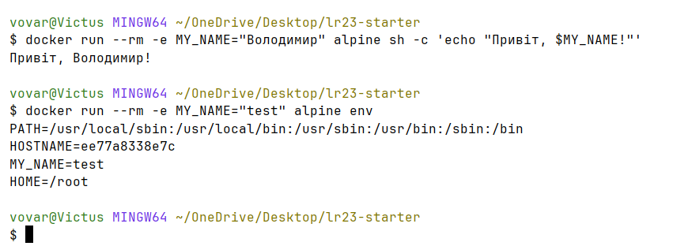

---

## Частина 2 — База даних + Adminer

### Завдання 7 — PostgreSQL у контейнері

Було запущено контейнер PostgreSQL з базою даних `studentdb`. Після цього за допомогою `psql` було виконано команду `SELECT version();`, яка підтвердила роботу PostgreSQL.

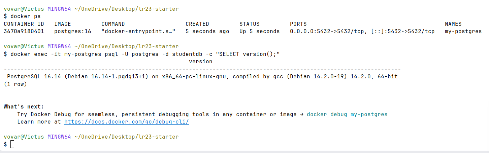

---

### Завдання 8 — Adminer через браузер

Було запущено контейнер Adminer і відкрито сторінку входу в браузері. Для підключення до PostgreSQL було використано сервер `host.docker.internal`, користувача `postgres`, пароль `secret` і базу даних `studentdb`.

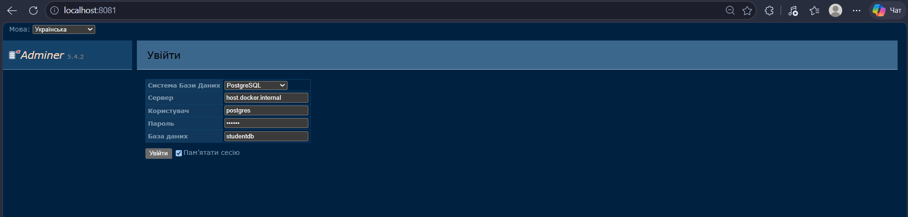

Після входу було створено таблицю `students`, додано кілька записів і виконано запит `SELECT * FROM students`.

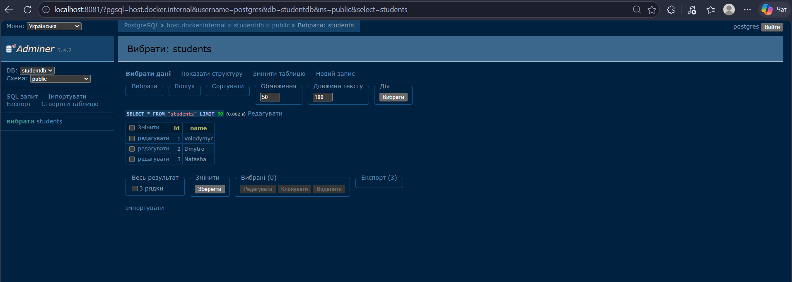

---

### Завдання 9 — docker compose up

Було запущено сервіси PostgreSQL та Adminer за допомогою Docker Compose.

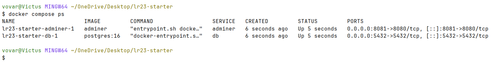

Після запуску через Docker Compose було виконано вхід в Adminer з використанням імені сервісу `db` як адреси сервера бази даних.

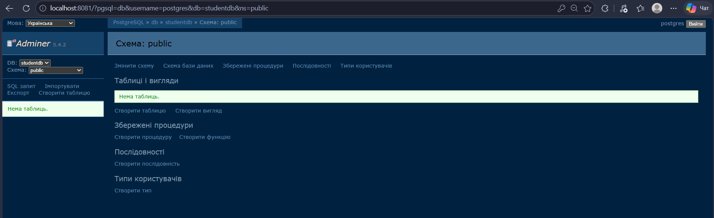

---

## Висновок

У ході лабораторної роботи було розглянуто основні можливості Docker. Було виконано запуск контейнерів з готових образів, перевірено роботу веб-сервера nginx, переглянуто логи контейнера, виконано вхід усередину контейнера через `docker exec`, а також розглянуто життєвий цикл контейнерів.

Окремо було перевірено роботу volume для збереження файлів після завершення контейнера, використання змінних середовища, запуск PostgreSQL у контейнері та підключення до нього через Adminer. Наприкінці було використано Docker Compose для запуску декількох сервісів однією командою.
