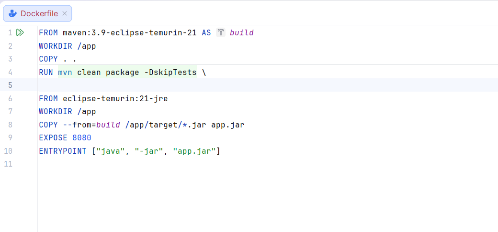
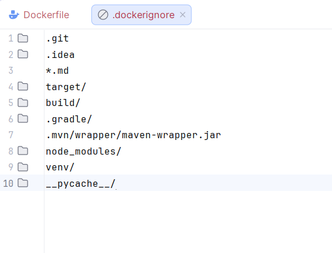
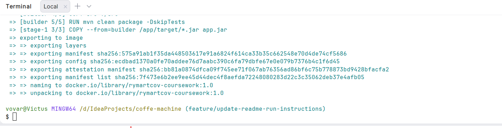
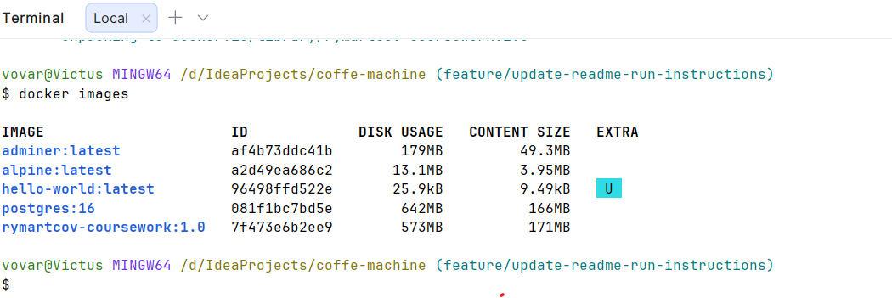
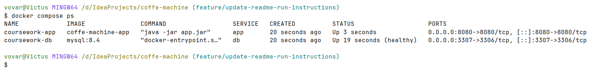
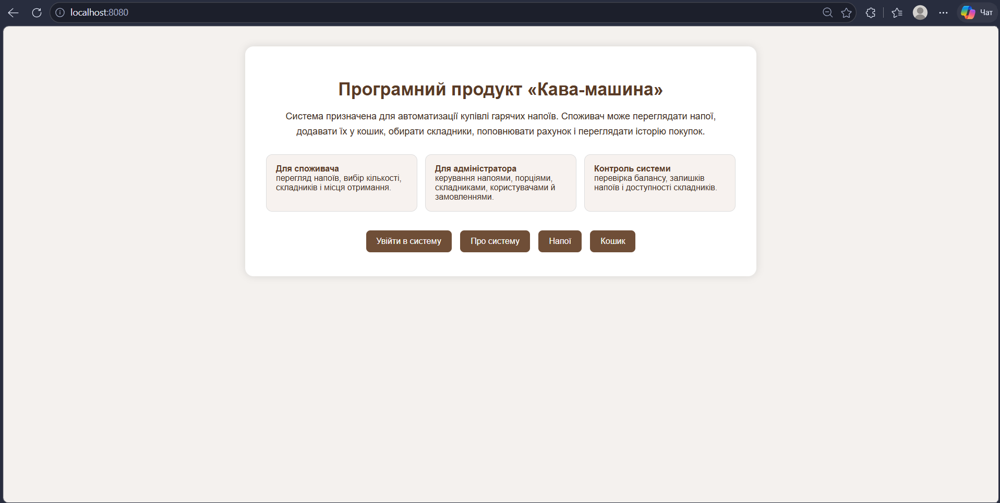
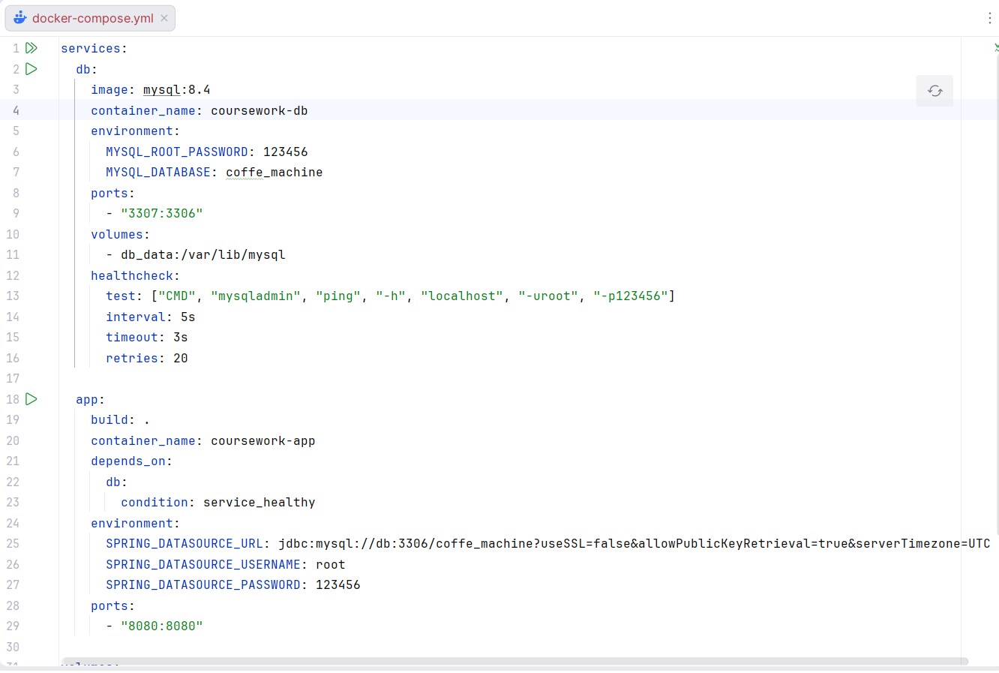

# Лабораторна робота №24

## Dockerfile і контейнеризація курсового проєкту

**Виконав:** Римарцов Володимир
**Група:** 371

---

# Завдання 1 — Dockerfile

Для контейнеризації курсового проєкту було створено файл `Dockerfile` у корені проєкту. Оскільки курсовий проєкт розроблений на Java з використанням Spring Boot і Maven, було обрано multi-stage Dockerfile. Перший етап відповідає за збірку `.jar` файлу, а другий — за запуск уже готового застосунку в легшому runtime-образі.

```dockerfile id="mna1l0"
FROM maven:3.9-eclipse-temurin-21 AS build
WORKDIR /app
COPY . .
RUN mvn clean package -DskipTests

FROM eclipse-temurin:21-jre
WORKDIR /app
COPY --from=build /app/target/*.jar app.jar
EXPOSE 8080
ENTRYPOINT ["java", "-jar", "app.jar"]
```

Було обрано образ `maven:3.9-eclipse-temurin-21`, тому що він містить Maven і JDK, потрібні для збірки Spring Boot застосунку. Для запуску використано `eclipse-temurin:21-jre`, оскільки у фінальному контейнері потрібен лише JRE і готовий `.jar` файл.



---

# Завдання 2 — .dockerignore

Для зменшення розміру контексту збірки було створено файл `.dockerignore`. Він виключає службові файли IDE, Git-репозиторій, папки збірки та інші зайві файли, які не потрібно копіювати в Docker-образ.

```text id="hz1pjj"
.git
.idea
*.md
target/
build/
.gradle/
.mvn/wrapper/maven-wrapper.jar
node_modules/
venv/
__pycache__/
```

Файл `.dockerignore` потрібен для того, щоб не передавати в Docker build зайві файли. Наприклад, папки `.git`, `.idea`, `target` і `build` можуть збільшити розмір контексту та зробити збірку повільнішою.



---

# Завдання 3 — Збірка образу

Збірка Docker-образу виконувалася з кореня проєкту командою:

```bash id="svi0zv"
docker build -t rymartcov-coursework:1.0 .
```

Після виконання команди Docker успішно зібрав образ курсового проєкту.



Після цього було перевірено список образів командою:

```bash id="ddpb3x"
docker images
```

У списку образів було видно створений образ:

```text id="dlu3t1"
rymartcov-coursework:1.0
```



---

# Завдання 4 — Запуск і перевірка контейнера

Під час спроби запуску лише контейнера застосунку було виявлено, що проєкт потребує підключення до бази даних MySQL. Без бази даних Spring Boot застосунок не може повноцінно запуститися, тому для запуску було використано Docker Compose.

Після запуску через Docker Compose було перевірено список контейнерів:

```bash id="wpdhz6"
docker compose ps
```

У результаті було видно два запущені контейнери: застосунок `coursework-app` та базу даних `coursework-db`.



Після цього у браузері було відкрито сторінку:

```text id="pnui4s"
http://localhost:8080
```

Сторінка курсового проєкту успішно відкрилася. Це підтверджує, що застосунок працює всередині Docker-контейнера.



---

# Завдання 5 — docker-compose.yml

Оскільки курсовий проєкт використовує MySQL, було створено файл `docker-compose.yml`, який запускає застосунок і базу даних разом. У цьому файлі база даних доступна для застосунку за іменем сервісу `db`, а не через `localhost`.

```yaml id="k9n5f4"
services:
  db:
    image: mysql:8.4
    container_name: coursework-db
    environment:
      MYSQL_ROOT_PASSWORD: 123456
      MYSQL_DATABASE: coffe_machine
    ports:
      - "3307:3306"
    volumes:
      - db_data:/var/lib/mysql
    healthcheck:
      test: ["CMD", "mysqladmin", "ping", "-h", "localhost", "-uroot", "-p123456"]
      interval: 5s
      timeout: 3s
      retries: 20

  app:
    build: .
    container_name: coursework-app
    depends_on:
      db:
        condition: service_healthy
    environment:
      SPRING_DATASOURCE_URL: jdbc:mysql://db:3306/coffe_machine?useSSL=false&allowPublicKeyRetrieval=true&serverTimezone=UTC
      SPRING_DATASOURCE_USERNAME: root
      SPRING_DATASOURCE_PASSWORD: 123456
    ports:
      - "8080:8080"

volumes:
  db_data:
```

Команда для запуску всього стеку:

```bash id="tjnicy"
docker compose up -d --build
```

Після виконання команди було перевірено роботу контейнерів:

```bash id="5p5ssa"
docker compose ps
```

Контейнер бази даних мав стан `healthy`, а контейнер застосунку — `Up`, що підтверджує успішний запуск усього стеку.




---

# Завдання 6 — Команда для викладача

Для запуску проєкту викладачеві достатньо отримати репозиторій з проєктом, перейти в його папку та виконати одну команду Docker Compose.

```bash id="v8bl40"
git clone <посилання-на-репозиторій>
cd coffe-machine
docker compose up -d --build
```

Основна команда запуску в папці проєкту:

```bash id="txjdy8"
docker compose up -d --build
```

Після запуску застосунок буде доступний за адресою:

```text id="ngk0bf"
http://localhost:8080
```

Було перевірено, що після запуску через Docker Compose база даних і застосунок стартують разом, а сторінка курсового проєкту відкривається у браузері.

---

# Відповіді на питання

## 1. Навіщо потрібен multi-stage build?

Multi-stage build потрібен для того, щоб розділити процес збірки та запуску застосунку. На першому етапі використовується повний образ з Maven і JDK, де збирається `.jar` файл. У фінальний образ потрапляє тільки готовий `.jar` і JRE, без Maven, вихідного коду та проміжних файлів збірки. Завдяки цьому фінальний образ стає меншим і простішим для запуску.

## 2. Що робить файл .dockerignore?

Файл `.dockerignore` виключає зайві файли з контексту збірки Docker. У моєму проєкті без нього в образ могли б потрапити `.git`, `.idea`, `target`, `build`, службові файли IDE та інші непотрібні дані. Це збільшило б розмір контексту, могло б сповільнити збірку та зробити образ менш охайним.

## 3. Чим відрізняються CMD і ENTRYPOINT?

`CMD` задає команду запуску контейнера за замовчуванням, яку можна легко перевизначити під час `docker run`. `ENTRYPOINT` більше підходить тоді, коли контейнер має завжди запускати конкретну програму. У цьому проєкті використано `ENTRYPOINT ["java", "-jar", "app.jar"]`, тому що контейнер призначений саме для запуску Spring Boot застосунку.

## 4. Чому застосунок у контейнері має слухати 0.0.0.0, а не localhost?

Якщо застосунок у контейнері слухає тільки `localhost` або `127.0.0.1`, він буде доступний лише всередині самого контейнера. Зовні, через проброшений порт Docker, до нього не вийде підключитися. Адреса `0.0.0.0` означає, що застосунок слухає всі мережеві інтерфейси контейнера, тому його можна відкрити з хост-машини через `localhost:8080`.

## 5. Чому передати викладачу образ або Docker-конфігурацію зручніше, ніж просто код?

Передати Docker-образ або Docker-конфігурацію зручніше, тому що викладачу не потрібно вручну встановлювати Java, Maven, MySQL та налаштовувати середовище. Усі потрібні залежності та параметри запуску вже описані в Dockerfile і docker-compose.yml. Це зменшує кількість помилок під час запуску і робить перевірку проєкту швидшою. Також Docker дозволяє запустити проєкт однаково на різних комп’ютерах.

---

# Чек-лист перед здачею

* [x] У звіті є титулка з ПІБ, групою, датою.
* [x] Dockerfile лежить у корені проєкту, його текст додано у звіт.
* [x] Додано `.dockerignore`.
* [x] `docker build` проходить без помилок.
* [x] Є скрін успішної збірки образу.
* [x] Є скрін `docker images` зі створеним образом.
* [x] Створено `docker-compose.yml` для запуску застосунку разом із MySQL.
* [x] Є скрін `docker compose ps`.
* [x] Є скрін працюючого застосунку у браузері.
* [x] Є команда для викладача.
* [x] Відповіді на всі 5 питань присутні.
* [x] Усі скріни потрібно перевірити перед здачею.

---

# Висновок

У ході лабораторної роботи було виконано контейнеризацію курсового проєкту «Кава-машина». Було створено Dockerfile для Spring Boot застосунку, додано файл `.dockerignore`, зібрано Docker-образ і перевірено його наявність у списку образів. Оскільки застосунок потребує базу даних MySQL, було створено `docker-compose.yml`, який запускає застосунок і базу даних разом. Після запуску через Docker Compose вебсторінка курсового проєкту успішно відкрилася в браузері за адресою `http://localhost:8080`. Це підтверджує, що курсовий проєкт можна запускати в контейнеризованому середовищі.

